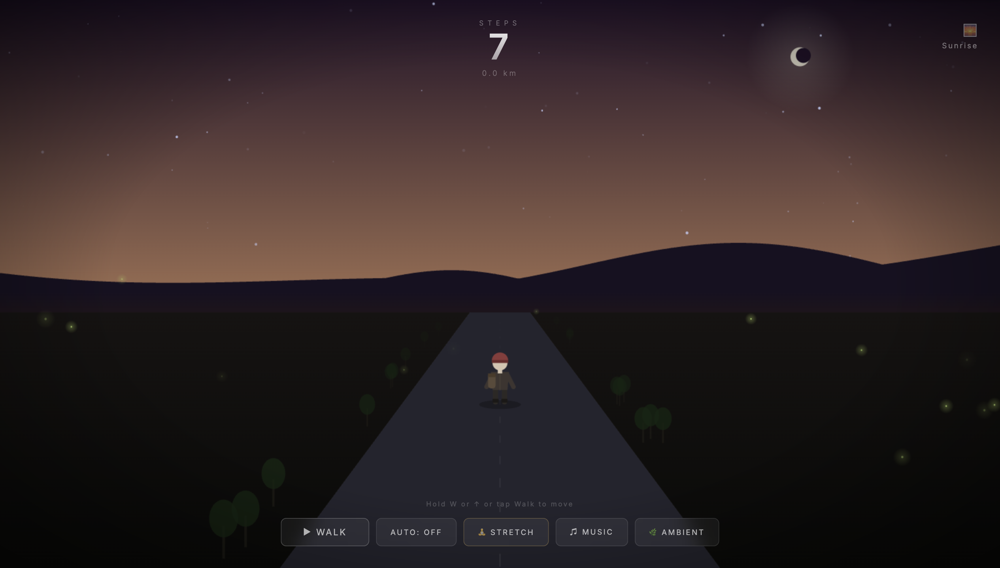

# Walking Simulator

An ASMR walking experience. Hold forward to walk through a peaceful landscape that shifts from day to night. Ambient music, nature sounds, and gentle stretch breaks along the way.

## Features

- **Hold to walk** — press W, ↑, or hold the Walk button to move forward
- **Auto-walk** — toggle hands-free walking
- **Day/night cycle** — sunrise, daytime, sunset, and night with smooth transitions
- **Ambient sounds** — birds during the day, owls and crickets at night (auto-switches)
- **Music** — 3 lo-fi instrumental tracks that cycle automatically
- **Stretch breaks** — 10 guided stretches with real-time character animation
- **Step counter** — tracks steps and distance walked

## Audio

All audio is pre-generated using [ElevenLabs](https://elevenlabs.io) APIs:

- 3 music tracks (Music Compose API)
- 3 footstep variations (Sound Generation API)
- 2 daytime ambient tracks (Sound Generation API)
- 2 nighttime ambient tracks (Sound Generation API)

To regenerate audio:

```bash
npm install
ELEVENLABS_API_KEY=sk_... node generate-audio.mjs
```

## Deploy

Static site — no build step. Deploy anywhere that serves HTML.

```bash
# Netlify
netlify login
netlify init
netlify deploy --prod
```

## License

MIT
